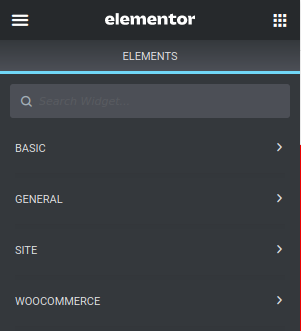
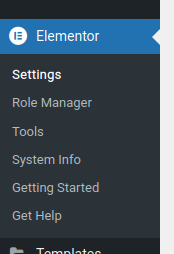

# Elementor - just free

Just show free stuff in the Elementor:

This plug-in will remove/hide pro features so the interface will be a bit cleaner.

<b>Keep in mind:</b> Remove the plug-in if you want to use [Elementor Pro](https://trk.elementor.com/26724)!

## Requirements

* [Elementor](https://trk.elementor.com/26724)

## Install

* Install [Elementor](https://trk.elementor.com/26724)
* Download and install this plug-in (https://github.com/m1ga/elementor_just_free/releases)

## Author

* Michael Gangolf (<a href="https://github.com/m1ga">@MichaelGangolf</a> / <a href="https://www.migaweb.de">Web</a>)

